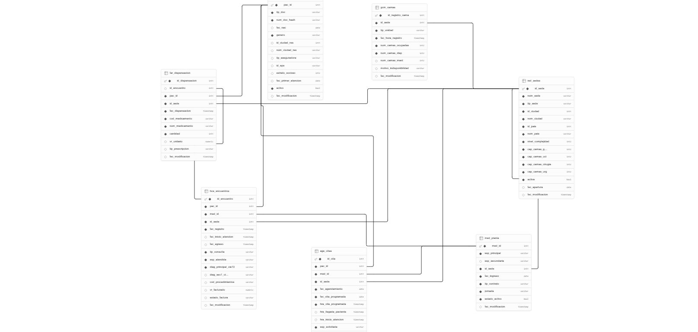

# HealthNet Data Pipeline — DataKnow Technical Assessment

**Candidato:** Alexander Genes Manjarrez  
**Sector:** C — Salud y Servicios Médicos  
**Plataforma:** Microsoft Azure + Databricks  
**Stack:** Databricks (DBR 13.3 LTS) + Delta Lake + Azure Data Factory + Terraform

---

## Sector y plataforma elegidos

**Sector — Salud y Servicios Médicos (HealthNet)**  
Se eligió el sector salud por los retos que representa para la estabilidad global después de la pandemia de COVID-19, que evidenció la necesidad crítica de sistemas de datos robustos para la toma de decisiones en tiempo real. En Colombia específicamente, el estado de la red hospitalaria presenta desafíos estructurales significativos — saturación de urgencias, tiempos de espera elevados, desigualdad en el acceso por regiones y limitaciones en la capacidad de camas UCI — que requieren datos confiables y oportunos para mejorar la atención a la población. La digitalización acelerada de los sistemas de salud en Latinoamérica genera grandes volúmenes de datos heterogéneos que requieren arquitecturas modernas para su procesamiento y análisis. Adicionalmente, la riqueza de los datos transaccionales — historias clínicas, agendamiento de citas, dispensación farmacéutica y gestión de camas — genera múltiples patrones de ingesta heterogénea (CSV, Parquet, JSON) y reglas de negocio complejas con alto valor analítico. El escenario simula una red hospitalaria de 82 sedes en Colombia, Perú y Ecuador.

**Plataforma — Microsoft Azure + Databricks**  
Azure fue seleccionado por mi experiencia de 4 años como Azure Data Engineer, durante los cuales he implementado soluciones de datos en múltiples proyectos productivos utilizando el stack completo de la plataforma. En distintos proyectos he trabajado con Azure Databricks para procesamiento de datos a escala, modelos analíticos y detección de anomalías, así como para el procesamiento de sistemas transaccionales complejos integrando fuentes heterogéneas y automatizando flujos que anteriormente eran manuales. Esta familiaridad con el ecosistema — ADLS Gen2, ADF, Databricks, Key Vault y Unity Catalog — me permite tomar decisiones de arquitectura fundamentadas en experiencia real, no solo en documentación técnica. La integración nativa entre estos servicios, combinada con Delta Lake y Change Data Feed, hace de Azure la plataforma más coherente para implementar una arquitectura Medallion robusta e incremental.

---

## Arquitectura

```
Azure SQL (fuente)
        ↓ AutoLoader (landing/ → SQL)
ADLS Gen2 landing/      ← zona de aterrizaje de archivos crudos
        ↓ Bronze (watermark fec_modificacion)
ADLS Gen2 bronze/       ← Delta Lake + CDF habilitado desde v0
        ↓ Silver (CDF incremental + MERGE)
ADLS Gen2 silver/       ← Delta Lake + CDF habilitado desde v0
        ↓ Gold (CDF incremental + MERGE)
ADLS Gen2 gold/         ← Delta Lake + CDF habilitado desde v0
        ↓
Power BI / Dashboards
```

**Orquestación:** Azure Data Factory — pl_orquestador (Schedule 02:00 AM UTC-5)  
**Gobierno:** Unity Catalog + Azure Key Vault + Azure AD Groups  
**Monitoreo:** Azure Monitor + Log Analytics

---

## Recursos Azure

| Recurso | Nombre | Región |
|---|---|---|
| Resource Group | rg-healthnet-dev | East US 2 |
| Storage Account ADLS Gen2 | dlshealthnetdev | East US 2 |
| Azure SQL Database | healthnet-source | Central US |
| Azure Key Vault | kv-healthnet-dev | East US 2 |
| Log Analytics Workspace | law-healthnet-dev | East US 2 |
| Databricks Workspace (Premium) | dbw-healthnet-dev | East US 2 |
| Azure Data Factory | adf-healthnet-dev | East US 2 |

**Containers ADLS:** landing, bronze, silver, gold, tfstate

---

## Tablas del modelo

| Tabla | Registros | Formato landing | Descripción |
|---|---|---|---|
| RED_SEDES | 82 | CSV | Catálogo de sedes de la red hospitalaria |
| MED_PLANTA | 2,000 | CSV | Médicos de planta por sede y especialidad |
| PAC_REGISTRO | 100,000 | Parquet | Registro maestro de pacientes |
| AGE_CITAS | 1,500,000 | Parquet | Agendamiento y atención de citas médicas |
| HCE_ENCUENTROS | 2,000,000 | Parquet | Historia clínica electrónica — encuentros |
| GCM_CAMAS | 499,954 | JSON | Gestión y ocupación de camas hospitalarias |
| FAR_DISPENSACION | 3,000,000 | JSON | Dispensación farmacéutica |
| **TOTAL FUENTE** | **7,101,036** | | |

---

## Conteos por capa — ejecución final

| Capa | Tabla | Registros |
|---|---|---|
| **Bronze** | AGE_CITAS | 1,500,000 |
| **Bronze** | FAR_DISPENSACION | 3,000,000 |
| **Bronze** | GCM_CAMAS | 499,954 |
| **Bronze** | HCE_ENCUENTROS | 2,000,000 |
| **Bronze** | MED_PLANTA | 2,000 |
| **Bronze** | PAC_REGISTRO | 100,000 |
| **Bronze** | RED_SEDES | 82 |
| **Bronze TOTAL** | | **7,101,036** |
| **Silver** | AGE_CITAS | 1,500,000 |
| **Silver** | FAR_DISPENSACION | 3,000,000 |
| **Silver** | GCM_CAMAS | 497,953 |
| **Silver** | HCE_ENCUENTROS | 1,993,893 |
| **Silver** | MED_PLANTA | 2,000 |
| **Silver** | PAC_REGISTRO | 100,000 |
| **Silver** | RED_SEDES | 82 |
| **Silver TOTAL** | | **6,993,928** |
| **Gold Dims** | dim_pacientes | 100,000 |
| **Gold Dims** | dim_medicos | 2,000 |
| **Gold Dims** | dim_sedes | 82 |
| **Gold Facts** | fact_consultas | 1,993,893 |
| **Gold Facts** | fact_costos_atencion | 1,993,893 |
| **Gold Facts** | fact_ocupacion_camas | 497,953 |
| **Gold Facts** | fact_tiempos_espera | 676,156 |
| **Gold Facts** | fact_alertas_epidemiologicas | 4 |
| **Gold KPIs** | kpis_resumen_ejecutivo | 12 |
| **Gold KPIs** | kpis_ocupacion_camas | 3,936 |
| **Gold KPIs** | kpis_tiempos_espera | 13,776 |
| **Gold KPIs** | kpis_volumen_consultas | 12,600 |
| **Gold KPIs** | kpis_alertas_epidemiologicas | 4 |

**Diferencias Silver vs Bronze esperadas:**
- HCE_ENCUENTROS: -6,107 registros — fechas fuera de rango (anomalía intencional ~0.3%)
- GCM_CAMAS: -2,001 registros — camas negativas (anomalía intencional ~0.4%)

---

## Decisiones técnicas clave

**AutoLoader en lugar de Event Trigger**  
El Event Trigger de ADF genera un pipeline run por archivo — inviable cuando múltiples archivos llegan simultáneamente. AutoLoader procesa lotes completos en un solo job, mantiene checkpoint en ADLS para garantizar exactamente-una-vez, y soporta schema evolution.

**fec_modificacion como watermark universal**  
Se agregó la columna `fec_modificacion DATETIME DEFAULT GETDATE()` a las 7 tablas de Azure SQL. El watermark de Bronze usa esta columna en lugar de fechas de negocio, lo que garantiza detectar tanto registros nuevos como modificados independientemente del rango temporal de los datos. Esta decisión permite que todas las tablas sean incrementales — incluyendo RED_SEDES y MED_PLANTA que antes eran full load.

**CDF habilitado desde v0**  
Change Data Feed se habilita en el momento de creación de cada tabla Delta (v0), antes de escribir los primeros datos. Esto evita el error `CDF not recorded for version 0` que ocurre cuando CDF se habilita después de que ya existen datos. El patrón es: crear tabla vacía con CDF → escribir datos → CDF disponible desde v0.

**Unity Catalog con .table() en lugar de .load(path)**  
La lectura CDF via `readChangeFeed` requiere permisos de tabla registrada en Unity Catalog cuando se ejecuta desde el service principal de ADF. Todas las tablas Delta se registran automáticamente en `dbw_healthnet_dev.default` al momento de creación y se otorgan permisos SELECT y MODIFY al service principal de ADF.

**Dimensiones completas vs Facts incrementales**  
Las dimensiones (dim_pacientes, dim_medicos, dim_sedes) y fact_alertas_epidemiologicas leen Silver completo en cada ejecución — son tablas pequeñas o requieren todos los datos históricos para calcular correctamente (ej: promedio móvil 8 semanas para alertas epidemiológicas). Las facts grandes usan CDF incremental para eficiencia.

**MERGE idempotente en Silver y Gold**  
Todas las escrituras en Silver y Gold usan operaciones MERGE (upsert) con la clave primaria de cada tabla. El pipeline puede ejecutarse múltiples veces sin generar duplicados.

**update_version_cdf con MERGE**  
La tabla `cdf_versions` se actualiza usando MERGE en lugar de UPDATE simple — si el registro no existe lo inserta, si existe lo actualiza. Esto resuelve el problema de versiones no registradas en la primera ejecución.

**Schema evolution habilitada**  
`mergeSchema = true` y `spark.databricks.delta.schema.autoMerge.enabled = true` en todas las capas. Nuevas columnas en la fuente SQL se propagan automáticamente sin intervención manual.

**Key Vault para todos los secretos**  
Ninguna credencial, token o contraseña aparece en el código. Todos los secretos se referencian desde el Secret Scope `healthnet-kv-scope`.

---

## Limitaciones conocidas

**1. Facts con tablas Silver compartidas procesan completo**  
Las facts que comparten tablas Silver (HCE_ENCUENTROS es usada por fact_consultas y fact_costos_atencion) procesan todos los registros en cada ejecución cuando corren en paralelo en ADF. El CDF funciona correctamente cuando las facts corren secuencialmente, pero en paralelo ambas leen la misma versión inicial antes de que alguna actualice `cdf_versions`.

**2. Alertas epidemiológicas con datos sintéticos uniformes**  
La tabla `fact_alertas_epidemiologicas` detecta desviaciones > 40% sobre el promedio histórico de 8 semanas. Con datos sintéticos generados con seed fijo (distribución uniforme), se generan pocas alertas reales (4 en la ejecución actual). En datos reales de producción el número de alertas sería significativamente mayor.

**3. Watermark con truncado de segundos**  
El watermark de Bronze se guarda truncado a segundos para compatibilidad con Azure SQL. Esto implica que registros con el mismo segundo exacto que el watermark podrían no ser detectados en la siguiente ejecución. La solución aplicada suma 1 segundo al watermark al guardarlo.

**4. Generador de datos sin offsets automáticos**  
El script de generación de datos usa IDs secuenciales desde 1. Para agregar datos incrementales sin conflictos de Primary Key, se requiere leer los máximos actuales de Azure SQL antes de generar nuevos datos.

**5. cdf_versions con registro huérfano**  
La tabla `cdf_versions` puede contener un registro `RED_SEDES/silver/-1` generado en la inicialización cuando la tabla no existía. Este registro no afecta el funcionamiento pero es semánticamente incorrecto.

---

## Mejoras futuras

**1. Trackear versiones CDF por notebook Gold en lugar de por tabla Silver**  
El conflicto de facts compartidas se resuelve usando una clave compuesta `(notebook, tabla, capa)` en `cdf_versions` en lugar de solo `(tabla, capa)`. Así cada notebook Gold trackea independientemente qué versión de Silver ya procesó.

**2. Generador con offsets automáticos desde SQL**  
Agregar lectura de máximos desde Azure SQL al inicio del generador para calcular offsets automáticamente. Esto permite agregar datos incrementales reales sin conflictos de PK y sin necesidad de borrar y recrear las tablas.

**3. Ejecución secuencial de facts en ADF**  
Cambiar `pl_gold_facts` para ejecutar las facts secuencialmente en lugar de en paralelo cuando comparten tablas Silver. Esto garantiza que CDF funcione correctamente en modo incremental real.

**4. Particionamiento dinámico en Bronze**  
Actualmente Bronze particiona por `_anio/_mes/_dia` de `fec_modificacion`. En producción sería más eficiente particionar por la fecha de negocio de cada tabla (ej: `fec_registro` para HCE_ENCUENTROS) para optimizar consultas analíticas históricas.

**5. Compactación automática de Delta Lake**  
Con múltiples ejecuciones incrementales, los archivos Delta se fragmentan. Implementar `OPTIMIZE` y `VACUUM` automáticos en las tablas grandes (HCE_ENCUENTROS, FAR_DISPENSACION) para mantener performance óptimo.

**6. Data Quality con Great Expectations**  
Reemplazar las 5 pruebas de calidad actuales (implementadas manualmente) por Great Expectations para mayor flexibilidad, mejor documentación y generación automática de reportes HTML.

**7. Manejo de late-arriving data**  
El watermark actual no maneja registros que lleguen tarde (ej: registros con `fec_modificacion` anterior al último watermark procesado). Implementar una ventana de tolerancia configurable para capturar datos tardíos.

**8. Circuit breaker en el orquestador**  
Agregar lógica de circuit breaker en `pl_orquestador` para detener automáticamente el pipeline cuando más de N tablas fallen, en lugar de continuar con las capas siguientes con datos incompletos.

---

## Estructura del repositorio

```
healthnet-pipeline/
├── README.md
├── CHANGELOG.md
├── .gitignore
├── data-generation/
│   ├── 00_subir_config_yaml.py
│   ├── 01_fase_generacion_datos.py
│   ├── 02_autoloader_landing_sql.py
│   └── generation_config.yaml
├── infra/
│   ├── main.tf
│   ├── variables.tf
│   ├── outputs.tf
│   ├── terraform.tfvars.example
│   ├── README.md
│   └── environments/
│       ├── dev/dev.tfvars
│       └── prod/prod.tfvars
├── pipelines/
│   ├── bronze/
│   │   ├── bronze_utils.py
│   │   └── bronze_[7 tablas].py
│   ├── silver/
│   │   ├── silver_utils.py
│   │   └── silver_[7 tablas].py
│   └── gold/
│       ├── gold_utils.py
│       ├── gold_dim_[3 dims].py
│       ├── gold_fact_[5 facts].py
│       ├── gold_kpis_ejecutivos.py
│       └── alerta_anomalia_volumen.py
├── orchestration/
│   └── adf_pipelines/
│       ├── pl_bronze.json
│       ├── pl_silver.json
│       ├── pl_gold_dims.json
│       ├── pl_gold_facts.json
│       ├── pl_gold_kpis.json
│       ├── pl_orquestador.json
│       └── pl_autoloader.json
└── docs/
    ├── data_catalog.md
    ├── HealthNet-ER.png
    └── evidencias/
        ├── alertas/
        ├── datos/
        ├── orquestacion/
        └── pipeline/
```

---

## Guía de despliegue

### Prerequisitos
- Azure CLI instalado y autenticado (`az login`)
- Terraform >= 1.5.0
- Python >= 3.9
- Databricks CLI configurado

### 1. Infraestructura

```bash
cd infra/
cp terraform.tfvars.example terraform.tfvars
# Editar terraform.tfvars con tus valores

terraform init
terraform plan -var-file="environments/dev/dev.tfvars"
terraform apply -var-file="environments/dev/dev.tfvars"
```

### 2. Configurar secretos en Key Vault

```bash
az keyvault secret set --vault-name kv-healthnet-dev --name sql-server --value "<server>"
az keyvault secret set --vault-name kv-healthnet-dev --name sql-user --value "healthnet-admin"
az keyvault secret set --vault-name kv-healthnet-dev --name sql-password --value "<password>"
az keyvault secret set --vault-name kv-healthnet-dev --name storage-access-key --value "<key>"
az keyvault secret set --vault-name kv-healthnet-dev --name databricks-token --value "<token>"
```

### 3. Primera carga de datos

```
1. 00_subir_config_yaml        → Sube generation_config.yaml a ADLS
2. 01_fase_generacion_datos    → Genera archivos en landing/
3. 02_autoloader_landing_sql   → Carga datos a Azure SQL
```

### 4. Ejecutar pipeline

```
ADF → pl_orquestador → Trigger now
```

### 5. Segunda ejecución incremental

Para agregar datos nuevos:
```
1. Modificar generation_config.yaml con nuevos volúmenes
2. 01_fase_generacion_datos    → Genera archivos nuevos en landing/
3. 02_autoloader_landing_sql   → AutoLoader detecta solo archivos nuevos
4. ADF → pl_orquestador        → Bronze detecta fec_modificacion nueva
```

---

## Pipelines ADF

| Pipeline | Descripción | Trigger |
|---|---|---|
| `pl_bronze` | 7 notebooks Bronze en paralelo | Desde pl_orquestador |
| `pl_silver` | 7 notebooks Silver con dependencias FK | Desde pl_orquestador |
| `pl_gold_dims` | 3 dims en paralelo | Desde pl_orquestador |
| `pl_gold_facts` | 5 facts en paralelo | Desde pl_orquestador |
| `pl_gold_kpis` | KPIs ejecutivos | Desde pl_orquestador |
| `pl_orquestador` | Bronze → Silver → Gold → Alerta Volumen | Schedule 02:00 AM UTC-5 |
| `pl_autoloader` | AutoLoader landing → SQL | Schedule hourly |

---

## Roles y accesos

| Rol | Grupo Azure AD | Permisos |
|---|---|---|
| Administrador | grp-healthnet-admin | Owner en Resource Group |
| Ingeniero de Datos | grp-healthnet-data-engineer | Contributor + Storage Blob Data Contributor |
| Analista | grp-healthnet-analyst | Reader + Storage Blob Data Reader solo en gold/ |

---

## Monitoreo y alertas

| Alerta | Trigger | Severidad |
|---|---|---|
| Fallo del pipeline | Cualquier actividad ADF falla | Sev 1 — inmediata |
| Reporte diario de éxito | Pipeline completa exitosamente | Sev 4 — informativa |
| Anomalía de volumen | Desviación > 30% vs promedio histórico | Sev 2 — en pipeline |

---

## Tablas de control Delta

| Path | Descripción |
|---|---|
| `bronze/_control/pipeline_watermark` | Último timestamp procesado por tabla |
| `bronze/_control/pipeline_log` | Log de cada ejecución Bronze |
| `bronze/_control/cdf_versions` | Versiones CDF procesadas por capa |
| `silver/_control/errores_pipeline` | Registros rechazados con motivo |
| `silver/_control/reporte_calidad` | Métricas de calidad por ejecución |
| `silver/_control/pruebas_calidad` | Resultados de las 5 pruebas automatizadas |
| `gold/_control/pipeline_log` | Log de cada ejecución Gold |

---

## Diagrama ER


